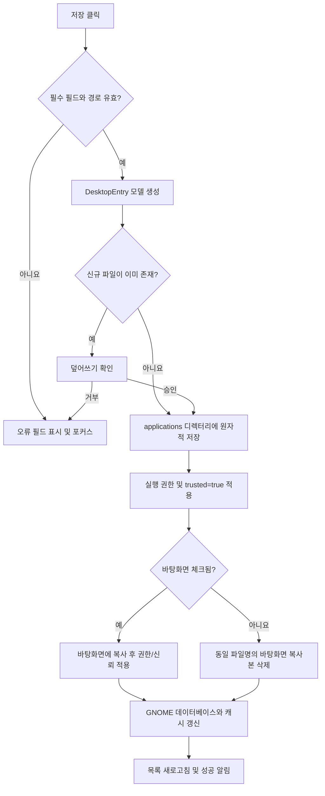

# SurplsShortcut GUI 설계안

## 1. 문서 목적

사용자별 GNOME `.desktop` 바로가기를 관리하는 Python `tkinter`/`ttk` 데스크톱 앱의 화면 구성, 사용자 흐름, 상태 관리 및 내부 구조를 정의한다.

GUI 버전의 핵심 목표는 다음과 같다.

- 등록된 앱을 한 화면에서 검색하고 상태를 확인한다.
- 등록과 수정을 하나의 일관된 폼으로 처리한다.
- 실행 파일, 아이콘, 바탕화면 바로가기 상태를 파일 선택 UI로 쉽게 관리한다.
- `.desktop` 파일 작성, 실행 권한, 신뢰 속성, GNOME 캐시 갱신을 사용자가 의식하지 않아도 처리한다.
- 이 프로그램이 만들지 않은 사용자 `.desktop` 파일을 수정하거나 삭제할 때 실수를 방지한다.

## 2. 범위

### MVP에 포함

- `~/.local/share/applications/*.desktop` 목록 조회
- 앱 이름, 실행 경로, 실행 옵션, 아이콘, 설명, 카테고리, 터미널 실행 여부 표시 및 편집
- 신규 `.desktop` 파일 생성
- 바탕화면 바로가기 생성, 동기화 및 삭제
- 실행 파일 주변의 아이콘 검색
- 시스템 아이콘 82종 선택
- 사용자 지정 아이콘 파일 선택
- `.desktop` 파일 삭제
- 실행 권한과 GIO `metadata::trusted=true` 적용
- GNOME 애플리케이션 데이터베이스 및 관련 캐시 갱신
- 한국어/영어 UI

### MVP에서 제외

- 시스템 영역인 `/usr/share/applications` 수정
- Flatpak/Snap 패키지 자체 설치 및 제거
- 여러 앱의 일괄 수정 또는 삭제
- `.desktop` 파일의 모든 확장 필드 편집
- GNOME 외 데스크톱 환경에 대한 완전한 호환 보장

## 3. UX 원칙

1. **목록 중심**: CLI의 4개 메뉴를 메인 목록과 툴바로 통합한다.
2. **즉시 검증**: 잘못된 경로나 필수 입력은 저장 버튼을 누르기 전에 표시한다.
3. **명시적 저장**: 편집 폼의 변경은 `저장` 전까지 파일에 반영하지 않는다.
4. **안전한 삭제**: 삭제 대상과 함께 앱 메뉴 파일 및 바탕화면 파일의 삭제 범위를 보여준다.
5. **상태 가시성**: 바탕화면 바로가기, 터미널 실행, 매니저 생성 여부를 목록에서 바로 확인한다.
6. **백그라운드 작업**: 아이콘 검색과 캐시 갱신 중에도 창이 응답하도록 한다.

## 4. 전체 화면 구조

앱은 단일 메인 창과 3개의 보조 다이얼로그로 구성한다.

- 메인 창: 목록 조회, 검색, 새 등록, 수정, 삭제
- 앱 편집 다이얼로그: 신규 등록과 기존 항목 수정에 공용 사용
- 아이콘 선택 다이얼로그: 주변 아이콘, 시스템 아이콘, 사용자 파일 선택
- 삭제 확인 다이얼로그: 실제 삭제 범위 확인

### 메인 창 와이어프레임

```text
┌────────────────────────────────────────────────────────────────────────────┐
│ SurplsShortcut                                      [한국어 ▼] [설정 ⚙]  │
├────────────────────────────────────────────────────────────────────────────┤
│ [＋ 새 앱 등록] [수정] [삭제] [↻ 새로고침]     검색 [______________]    │
├────────────────────────────────────────────────────────────────────────────┤
│ 아이콘  이름          실행 파일            분류     실행 방식 바탕화면 관리 상태│
│────────────────────────────────────────────────────────────────────────────│
│ [icon] Antigravity  /opt/antigravity/...  개발     일반 실행  — 없음  ✓ 관리 항목│
│ [icon] My Tool      /opt/my-tool/run.sh    유틸리티 터미널    ✓ 있음  ✓ 관리 항목│
│ [icon] Other App    /usr/bin/other        기타     일반 실행  — 없음  외부 항목 │
│                                                                            │
├────────────────────────────────────────────────────────────────────────────┤
│ 선택 항목                                                                     │
│ [아이콘 프리뷰]  Antigravity IDE                                            │
│                  Exec: "/opt/antigravity/antigravity" %u                   │
│                  파일: ~/.local/share/applications/antigravity-ide.desktop  │
│                  실행 방식: 일반 실행 · 바탕화면: ✓ 있음 · 관리: ✓ 관리 항목│
├────────────────────────────────────────────────────────────────────────────┤
│ 준비됨 · 등록된 앱 12개                                      [폴더 열기]   │
└────────────────────────────────────────────────────────────────────────────┘
```

### 메인 목록 컬럼

| 컬럼 | 값 | 비고 |
|---|---|---|
| 아이콘 | `Icon` | 테마 아이콘 또는 파일 경로를 32px 썸네일로 표시, 해석 실패 시 기본 실행 아이콘 |
| 이름 | `Name` | 기본 정렬 기준 |
| 실행 파일 | `Exec`에서 분리한 실행 경로 | 긴 값은 말줄임, 툴팁으로 전체 표시 |
| 분류 | `Categories` | 첫 번째 대표 분류를 번역해서 표시 |
| 실행 방식 | `Terminal` | `터미널` 또는 `일반 실행`처럼 의미를 직접 표시 |
| 바탕화면 | 동일 파일명 존재 여부 | `✓ 있음` 또는 `— 없음`으로 표시 |
| 관리 상태 | `X-Created-By=shortcut-manager` 여부 | `✓ 관리 항목` 또는 `외부 항목`으로 구분 |

### 메인 창 동작

- 행 선택 시 하단 상세 패널의 텍스트와 64px 아이콘 프리뷰를 함께 갱신한다.
- 내부 Boolean 값을 `true`/`false`로 노출하지 않고 현재 언어의 의미 있는 상태 문구로 변환한다.
- 대표 분류는 `Utility`, `Development` 같은 저장값을 현재 언어의 표시명으로 변환한다.
- 최소 창 크기에서 컬럼이 잘릴 경우 가로 스크롤로 전체 내용을 확인할 수 있다.
- 행 더블클릭 또는 `Enter`는 수정 다이얼로그를 연다.
- `Delete` 키는 삭제 확인 다이얼로그를 연다.
- `Ctrl+N`은 새 등록, `Ctrl+F`는 검색창 포커스, `F5`는 새로고침으로 연결한다.
- 선택 항목이 없으면 `수정`과 `삭제` 버튼을 비활성화한다.
- 검색은 이름, 실행 경로, 파일명에 대해 대소문자 구분 없이 즉시 필터링한다.
- 창 크기 기본값은 약 `1000x680`, 최소 크기는 `820x560`으로 한다.

## 5. 신규 등록 및 수정 화면

등록과 수정은 같은 `AppEditorDialog`를 사용한다. 신규 등록 시 빈 모델과 추천 기본값을 전달하고, 수정 시 선택한 `.desktop` 파일을 파싱한 모델을 전달한다.

```text
┌────────────────────── 새 앱 등록 / 앱 수정 ──────────────────────────────┐
│ 기본 정보                                                                  │
│ 앱 이름*       [Antigravity IDE________________________]                  │
│ 설명           [Antigravity development environment____]                  │
│                                                                            │
│ 실행 설정                                                                  │
│ 실행 파일*     [/opt/antigravity/antigravity___________] [찾아보기…]      │
│                 ✓ 파일 존재  ✓ 실행 가능                                   │
│ ☐ --no-sandbox 사용  ⚠ 꼭 필요한 경우에만 사용      [환경 진단…]       │
│ 추가 옵션      [_______________________________________]                  │
│                 최종 Exec: "/opt/antigravity/antigravity" %u             │
│ □ 터미널에서 실행                                                         │
│                                                                            │
│ 표시 설정                                                                  │
│ 아이콘         [미리보기] user-desktop             [아이콘 선택…]         │
│ 카테고리       [Development (개발 도구) ▼]                                │
│ ☑ 바탕화면 바로가기 생성                                                   │
│                                                                            │
│ 대상 파일: ~/.local/share/applications/antigravity-ide.desktop            │
│                                              [취소] [저장]                 │
└────────────────────────────────────────────────────────────────────────────┘
```

### 필드 정의

| 필드 | 위젯 | 기본값/동작 | 검증 |
|---|---|---|---|
| 앱 이름 | `ttk.Entry` | 실행 파일명에서 확장자를 제거하고 `-`, `_`를 공백으로 변환 | 공백 불가 |
| 설명 | `ttk.Entry` | `<앱 이름> Application` | 선택 사항 |
| 실행 파일 | `ttk.Entry` + 파일 선택 | 선택 즉시 절대 경로로 정규화 | 존재, 파일 여부 검사 |
| `--no-sandbox` | `ttk.Checkbutton` | 신규 등록은 `false`, 기존 옵션에 있으면 `true` | 선택 시 보안 경고 표시 |
| 추가 옵션 | `ttk.Entry` | 빈 문자열 | 필드 코드 규칙 적용 |
| 최종 Exec | 읽기 전용 라벨/Entry | 입력 변화 시 실시간 생성 | 직접 편집하지 않음 |
| 터미널 실행 | `ttk.Checkbutton` | `false` | Boolean |
| 아이콘 | 미리보기 + 선택 버튼 | 주변 아이콘 또는 시스템 기본 아이콘 | 사용자 경로는 파일 존재 검사 |
| 카테고리 | `ttk.Combobox(state="readonly")` | `Utility;` | 7개 값 중 하나 |
| 바탕화면 바로가기 | `ttk.Checkbutton` | 신규 등록은 `true`, 수정은 실제 파일 존재 여부 | 저장 시 복사/삭제 |

지원 카테고리는 `Utility`, `Development`, `Game`, `Network`, `AudioVideo`, `Office`, `System`이다.

### 실행 파일 권한 UX

실행 파일이 존재하지만 실행 권한이 없으면 필드 아래에 노란 경고를 표시한다.

```text
⚠ 이 파일에는 실행 권한이 없습니다.  [실행 권한 부여]
```

`실행 권한 부여`를 누르면 확인 후 현재 사용자 실행 권한을 추가한다. 권한을 부여하지 않아도 저장은 허용하되, 실행 실패 가능성을 저장 확인창 또는 인라인 경고로 알린다.

### `Exec` 생성 규칙

- 실행 경로는 큰따옴표로 감싼다.
- `--no-sandbox` 체크박스가 선택된 경우에만 해당 옵션을 한 번 추가한다.
- 수정 화면을 열 때 기존 옵션에 독립된 토큰 `--no-sandbox`가 있으면 체크박스를 자동 선택하고 일반 추가 옵션 입력에서는 분리한다.
- 추가 옵션은 경로와 별도로 보존한다.
- `%f`, `%F`, `%u`, `%U` 중 어느 것도 없으면 `%u`를 자동 추가한다.
- 수정 시 실행 경로만 바꾸더라도 기존 추가 옵션을 유지한다.
- 최종 생성 문자열을 읽기 전용으로 항상 보여준다.

예시:

```text
실행 파일: /opt/bruno/bruno.AppImage
추가 옵션: --no-sandbox
최종 Exec: "/opt/bruno/bruno.AppImage" --no-sandbox %u
```

### `--no-sandbox` 판단 정책

실행하지 않고도 일부 환경 조건을 읽을 수 있지만, 특정 앱이 실제로 샌드박스 오류를 낼지는 확정할 수 없다. Electron/Chromium 버전과 빌드 방식, 패키징, 커널 설정, AppArmor 프로필, setuid sandbox 포함 여부가 함께 영향을 주기 때문이다.

또한 `--no-sandbox`는 Chromium/Electron의 프로세스 격리를 끄는 옵션이므로 신규 등록에서 기본값은 항상 `false`로 둔다. 앱 파일명이나 AppImage 여부만으로 자동 체크하지 않는다.

#### 실행하지 않고 확인 가능한 항목

`환경 진단`은 대상 앱을 실행하지 않고 다음 항목을 읽기 전용으로 검사한다.

| 검사 항목 | 판단 가능한 내용 | 한계 |
|---|---|---|
| 기존 `Exec` 또는 동일 실행 경로의 다른 바로가기 | 이미 `--no-sandbox`를 사용 중인지 | 과거 설정이 현재도 필요한지는 알 수 없음 |
| `resources/app.asar`, `chrome-sandbox` 등 주변 파일 | Electron/Chromium 계열일 가능성 | 해당 파일만으로 실행 실패를 확정할 수 없음 |
| `chrome-sandbox`의 소유자, 실행 권한, setuid 비트 | 전통적인 SUID sandbox의 구성 이상 가능성 | 앱이 SUID sandbox를 실제로 사용하는지는 별도 문제 |
| `/proc/sys/kernel/unprivileged_userns_clone` | 비특권 user namespace의 전역 허용 여부 | AppArmor의 앱별 허용 여부까지 나타내지 않음 |
| `/proc/sys/kernel/apparmor_restrict_unprivileged_userns` | Ubuntu AppArmor 제한 활성화 여부 | 대상 경로에 맞는 허용 프로필 적용 여부는 별도 확인 필요 |
| `/etc/apparmor.d` 및 로드된 프로필 | 대상 실행 경로를 허용할 가능성이 있는 프로필 | 경로 패턴과 프로필 규칙을 완전히 해석하지 않으면 확정 불가 |

정적 진단 결과는 다음 3단계로만 표현한다.

- `정상 가능성 높음`: 알려진 구성 문제가 발견되지 않음
- `샌드박스 문제 가능성 있음`: 제한은 활성화되어 있고 대상 앱의 허용 구성을 찾지 못함
- `판단 불가`: Electron/Chromium 여부 또는 적용 프로필을 확정할 수 없음

`문제 가능성 있음`도 체크박스를 강제로 선택하지 않고 추천 메시지만 표시한다.

```text
⚠ 샌드박스 문제 가능성이 있습니다.
  AppArmor user namespace 제한은 활성화되어 있지만 이 실행 경로에
  적용되는 허용 프로필을 확인하지 못했습니다.

  실행 오류가 실제로 발생한 경우에만 --no-sandbox를 사용하세요.
```

#### 자동 체크가 허용되는 경우

- 수정할 기존 `Exec`에 `--no-sandbox`가 이미 있으면 현재 설정을 표현하기 위해 자동 체크한다.
- 동일 실행 경로의 기존 바로가기에서 옵션을 발견한 경우에는 “기존 설정 가져오기” 확인을 받은 뒤 체크한다.
- 정적 환경 진단 결과만으로는 자동 체크하지 않는다.

실제 오류의 확정은 결국 앱을 일반 옵션으로 실행하고 초기 표준 오류 또는 종료 코드를 확인해야 한다. GUI에 향후 `실행 테스트`를 추가한다면 반드시 사용자가 명시적으로 눌렀을 때만 실행하고, `No usable sandbox`, `SUID sandbox helper`, `Failed to move to new namespace` 같은 오류가 확인된 경우 체크를 제안한다.

체크박스를 직접 켜면 다음 경고를 인라인으로 표시한다.

```text
⚠ --no-sandbox는 앱의 프로세스 격리를 비활성화합니다.
  샌드박스 오류 때문에 앱이 실행되지 않을 때만 사용하세요.
```

진단 기능은 AppArmor나 커널 설정을 자동 변경하지 않는다. 가능하면 앱에 맞는 AppArmor 프로필이나 정상 구성된 sandbox helper를 우선 해결책으로 안내한다.

### 파일명 정책

- 신규 등록은 앱 이름을 소문자 ASCII ID로 변환한다.
- 영문/숫자 이외 문자를 `-`로 바꾸고 중복 `-`를 정리한다.
- 변환 결과가 비어 있으면 `app-<랜덤 ID>.desktop`을 사용한다.
- 같은 파일이 이미 있으면 자동 덮어쓰기하지 않고 `덮어쓰기`, `다른 이름 사용`, `취소` 중 선택하게 한다.
- 기존 항목 수정 시 앱 이름을 변경해도 `.desktop` 파일명은 유지한다. 파일명 변경은 별도 기능으로 취급한다.

## 6. 아이콘 선택 다이얼로그

아이콘 선택은 탭 3개로 구성한다.

```text
┌────────────────────────── 아이콘 선택 ──────────────────────────┐
│ [주변에서 찾음 (6)] [시스템 아이콘] [사용자 파일]               │
├──────────────────────────────────────────────────────────────────┤
│ 검색 [____________________]                                     │
│                                                                  │
│ [icon] app.png     [icon] logo.svg     [icon] icon-256.png       │
│                                                                  │
│ 선택: /opt/app/assets/app.png                                   │
│                                          [취소] [이 아이콘 사용] │
└──────────────────────────────────────────────────────────────────┘
```

### 주변에서 찾음

- 실행 파일이 있는 디렉터리 아래 최대 3단계에서 검색한다.
- 확장자: `.png`, `.svg`, `.ico`, `.xpm`, `.jpg`, `.jpeg`
- 검색 중 진행 표시와 `검색 취소`를 제공한다.
- 검색은 작업 스레드에서 실행하고, 결과 반영은 `after()`로 메인 스레드에서 수행한다.
- 결과가 많으면 최초 100개까지만 표시하고 전체 경로 검색 필터를 제공한다.

### 시스템 아이콘

- `resources/system_icons.py`의 시스템 아이콘 목록과 한·영 설명을 데이터로 사용한다.
- 이름/설명 검색을 지원한다.
- 현재 테마에서 미리보기를 찾지 못해도 아이콘 이름 자체는 선택 가능하다.

### 사용자 파일

- `filedialog.askopenfilename()`으로 지원 확장자를 제한한다.
- 선택한 경로를 절대 경로로 저장한다.
- 미리보기는 PNG만 표시한다. PNG가 아닌 파일(JPG, ICO, XPM, SVG)은 실행 파일이 있는 폴더의 `icon_cache/`에 `<원본이름>_<crc32>.png`로 변환(최대 256px)한 뒤 그 PNG를 미리보기와 `Icon=` 값으로 사용한다.
- 변환은 Pillow로 하고, SVG는 `rsvg-convert`가 있을 때만 변환한다. 변환할 수 없는 파일은 미리보기를 표시하지 않으며 선택 확정을 비활성화한다.
- 주변 검색은 `icon_cache/` 폴더를 제외하고, 변환할 수 없는 파일은 목록에 표시하지 않는다.

## 7. 저장 흐름



### 저장 결과

기본 `.desktop` 파일 형식은 다음과 같다.

```ini
[Desktop Entry]
Version=1.0
Type=Application
Name=Antigravity IDE
Comment=Antigravity development environment
Exec="/opt/antigravity/antigravity" %u
Icon=user-desktop
Terminal=false
Categories=Development;
StartupNotify=true
X-Created-By=shortcut-manager
```

### 바탕화면 상태 처리

- 수정 다이얼로그를 열 때 `DESKTOP_DIR/<동일 파일명>`의 실제 존재 여부를 읽는다.
- 체크가 `false → true`이면 저장된 최신 파일을 바탕화면에 복사한다.
- 체크가 `true → false`이면 바탕화면 복사본만 삭제한다.
- 체크가 계속 `true`이면 수정 내용을 바탕화면 복사본과 동기화한다.
- 복사 후 소유자 실행 권한과 GIO `metadata::trusted`의 정확한 문자열 값 `true`를 설정한다.
- 신뢰 속성 설정에 실패하면 등록 자체는 유지하되, “우클릭 → Allow Launching이 필요할 수 있음”을 경고한다.

## 8. 삭제 흐름

삭제는 반드시 전용 확인 다이얼로그를 사용한다.

```text
┌──────────────────────── 단축 아이콘 삭제 ───────────────────────┐
│ Antigravity IDE를 삭제하시겠습니까?                             │
│                                                                  │
│ 삭제 대상                                                       │
│ • 앱 메뉴: ~/.local/share/applications/antigravity-ide.desktop  │
│ • 바탕화면: ~/Desktop/antigravity-ide.desktop                   │
│                                                                  │
│ 이 작업은 실제 프로그램 /opt/antigravity/antigravity를          │
│ 삭제하지 않습니다.                                              │
│                                            [취소] [삭제]         │
└──────────────────────────────────────────────────────────────────┘
```

처리 순서는 다음과 같다.

1. 대상 `.desktop` 파일을 다시 확인한다.
2. 매니저 생성 항목이 아니면 강조 경고를 추가한다.
3. 사용자 확인 후 앱 메뉴 파일을 삭제한다.
4. 같은 파일명의 바탕화면 복사본이 있으면 함께 삭제한다.
5. GNOME 데이터베이스를 갱신하고 목록에서 제거한다.

실행 파일과 아이콘 원본은 삭제하지 않는다.

## 9. 언어 설정

- 첫 실행은 시스템 로케일이 `ko_*`이면 한국어, 그 외에는 영어를 기본값으로 한다.
- 우측 상단 언어 콤보박스에서 즉시 변경할 수 있다.
- 모든 UI 문자열은 `i18n.py`의 키 기반 사전으로 관리한다.
- 언어 선택은 `~/.config/surpls-shortcut/config.json`에 저장한다.
- `.desktop` 파일의 `Name`, `Comment`는 사용자가 입력한 값을 그대로 저장하며 UI 언어 변경으로 바꾸지 않는다.

## 10. 상태 및 오류 표시

### 상태바

- `준비됨`
- `등록된 앱 12개`
- `아이콘 검색 중…`
- `GNOME 데이터베이스 갱신 중…`
- `저장 완료: antigravity-ide.desktop`

성공 메시지는 상태바에 4~5초 표시하고 자동으로 일반 상태로 돌아간다. 사용자가 반드시 알아야 하는 오류와 삭제 확인만 모달 대화상자를 사용한다.

### 오류 처리 정책

| 상황 | UI 처리 |
|---|---|
| 실행 파일 없음 | 필드 아래 오류 및 저장 비활성화 |
| 디렉터리를 실행 파일로 선택 | “파일을 선택하세요” 인라인 오류 |
| 사용자 아이콘 없음 | 아이콘 선택 확정 비활성화 |
| `.desktop` 파싱 실패 | 목록에는 “읽기 오류” 표시, 수정 시 원문 보기 제공 |
| 파일 쓰기 권한 없음 | 오류 대화상자에 대상 경로와 시스템 메시지 표시 |
| 바탕화면 복사 실패 | 앱 메뉴 저장 성공 여부와 분리해 부분 성공 경고 |
| `gio` 없음/신뢰 설정 실패 | Allow Launching 수동 설정 안내 |
| 캐시 갱신 명령 없음 | 저장은 성공 처리하고 상태바에 낮은 우선순위 경고 |

## 11. 내부 데이터 모델

```python
@dataclass
class DesktopEntry:
    file_path: Path | None
    file_name: str
    name: str
    comment: str
    executable_path: str
    no_sandbox: bool
    execution_options: str
    exec_value: str
    icon: str
    terminal: bool
    categories: list[str]
    startup_notify: bool = True
    manager_created: bool = True
    desktop_copy_exists: bool = False
    extra_fields: dict[str, str] = field(default_factory=dict)
```

`extra_fields`는 외부에서 만든 `.desktop` 파일을 수정할 때 GUI가 지원하지 않는 필드를 잃지 않기 위해 필요하다. 저장 시 관리 필드만 갱신하고 `MimeType`, `Actions`, `NoDisplay`, `StartupWMClass` 등의 기존 필드는 보존한다.

## 12. 권장 코드 구조

```text
SurplsShortcut/
├── app.py                         # 진입점, Tk 루트와 전역 예외 처리
├── version.py                     # manifest.json 읽기, 릴리스 노트/커밋 메시지 생성
├── manifest.json                  # 릴리스 이력: version, date, note
├── dist.py                        # 실행 파일 빌드와 릴리스 게시
├── dist/                          # <version>_<date>/ 별 실행 파일과 release.md
├── models.py                      # DesktopEntry 데이터 모델
├── config.py                      # 경로, 사용자 설정, 카테고리
├── i18n.py                        # 한국어/영어 문자열
├── services/
│   ├── desktop_entry_service.py   # 파싱, Exec 처리, 저장, 삭제
│   ├── icon_service.py            # 주변/시스템 아이콘 검색, PNG 변환 캐시
│   ├── sandbox_service.py         # 읽기 전용 샌드박스 진단
│   └── gnome_service.py           # 권한, trusted, 캐시 갱신
├── ui/
│   ├── main_window.py             # 목록, 검색, 상세 패널
│   ├── app_editor.py              # 등록/수정 공용 다이얼로그
│   ├── icon_picker.py             # 아이콘 선택 다이얼로그
│   └── delete_dialog.py           # 삭제 범위 확인
├── resources/
│   └── system_icons.py            # 시스템 아이콘 이름과 설명
└── tests/
    ├── test_desktop_entry.py
    ├── test_exec_builder.py
    ├── test_desktop_sync.py
    ├── test_sandbox.py
    └── test_version.py
```

### 계층 책임

- UI 계층은 파일을 직접 수정하지 않고 서비스 계층을 호출한다.
- 서비스 계층은 `tkinter` 위젯을 참조하지 않는다.
- 파싱과 `Exec` 생성은 순수 함수로 분리해 단위 테스트한다.
- 외부 명령은 `subprocess.run([...], shell=False, capture_output=True)`로 실행한다.
- Tkinter 위젯 갱신은 반드시 메인 스레드에서 실행한다.

## 13. 파일 처리 및 안전성

- 사용자 앱 경로는 `XDG_DATA_HOME`이 있으면 `$XDG_DATA_HOME/applications`, 없으면 `~/.local/share/applications`를 사용한다.
- 바탕화면 경로는 `xdg-user-dir DESKTOP` 결과를 우선하고 실패하면 `~/Desktop`을 사용한다.
- 신규 파일은 임시 파일에 쓴 뒤 `os.replace()`로 교체하여 중간 상태를 방지한다.
- 기존 파일 수정 시 지원하지 않는 키를 보존한다.
- 파일 쓰기 전에 현재 디스크 내용이 처음 읽었을 때와 달라졌는지 검사해 외부 변경 충돌을 알린다.
- 경로와 실행 옵션을 문자열로 합쳐 셸에서 실행하지 않는다.
- 앱 이름, 설명에 줄바꿈이나 `.desktop` 구문을 깨뜨릴 수 있는 문자가 들어오면 이스케이프한다.
- 목록은 사용자 애플리케이션 디렉터리의 모든 `.desktop` 파일을 보여주되, 매니저 생성 여부를 항상 구분한다.

## 14. 접근성 및 키보드 사용

- 탭 순서는 위에서 아래, 왼쪽에서 오른쪽으로 자연스럽게 구성한다.
- 모든 입력 라벨에 키보드 접근 가능한 연결을 제공한다.
- 상태를 색이나 `true`/`false`에 의존하지 않고 `✓ 있음`, `— 없음`, `외부 항목`처럼 아이콘과 의미 있는 텍스트를 함께 사용한다.
- 오류 발생 시 첫 오류 필드에 포커스를 이동한다.
- 다이얼로그의 `Esc`는 취소, `Ctrl+Enter`는 저장으로 동작한다.
- 기본 폰트와 시스템 테마를 따르고 고정 색상 사용을 최소화한다.

## 15. 구현 단계

### 1단계: 도메인 로직 분리

- `.desktop` 파서와 직렬화기
- `Exec` 경로/옵션 분리 및 필드 코드 보정
- 파일 ID 생성
- 바탕화면 동기화와 GNOME 반영 서비스
- 핵심 단위 테스트

### 2단계: 기본 GUI

- 메인 목록과 상세 패널
- 등록/수정 공용 다이얼로그
- 삭제 확인
- 검색과 새로고침

### 3단계: 아이콘 UX

- 주변 아이콘 비동기 검색
- 시스템 아이콘 검색
- 파일 선택과 미리보기

### 4단계: 완성도

- 한국어/영어 전환
- 설정 저장
- 외부 파일 변경 충돌 처리
- 오류 메시지와 부분 성공 처리
- 패키징 및 실행용 `.desktop` 파일 제공

## 16. MVP 완료 기준

- 앱 실행 후 사용자 `.desktop` 목록이 UI를 멈추지 않고 표시된다.
- 신규 등록 결과가 GNOME 앱 메뉴에서 검색되고 실행된다.
- 수정 저장 시 앱 메뉴 파일과 선택된 바탕화면 복사본이 일치한다.
- 바탕화면 체크 상태가 실제 파일 존재 여부와 일치한다.
- 바탕화면 파일을 더블클릭할 때 별도 Allow Launching 설정 없이 실행 가능하다.
- 삭제 시 앱 메뉴와 바탕화면 복사본만 제거되고 실행 파일은 보존된다.
- 외부에서 만든 `.desktop` 파일을 저장해도 알려지지 않은 기존 필드가 유실되지 않는다.
- 한국어와 영어에서 주요 화면과 오류 메시지가 잘리지 않는다.
- 경로에 공백이 포함된 실행 파일과 아이콘을 정상 처리한다.

## 17. 버전 관리와 배포

- `manifest.json`은 `{ "version", "date", "note": [...] }` 항목의 배열이며, 날짜 다음 버전 순으로 가장 최신 항목이 창 제목의 `(vX.Y.Z)` 표시와 배포 폴더 이름을 결정한다.
- `dist.py`는 PyInstaller로 Python 없이 실행되는 단일 실행 파일을 `dist/<version>_<date>/`에 만들고, `manifest.json` 전체를 Markdown으로 옮긴 `release.md`를 함께 둔다.
- 빌드 Python에서 `tkinter`를 가져올 수 없으면 Tcl/Tk가 누락된 실행 파일이 만들어지므로 빌드를 중단한다.
- 빌드 후 최신 릴리스 노트를 커밋 메시지로 삼아 커밋·푸시하고, 이어서 `v<version>` Git 태그 생성 여부를 묻는다.
- PyInstaller는 크로스 컴파일을 지원하지 않으므로 실행 파일은 빌드한 플랫폼(Linux)용이다.
