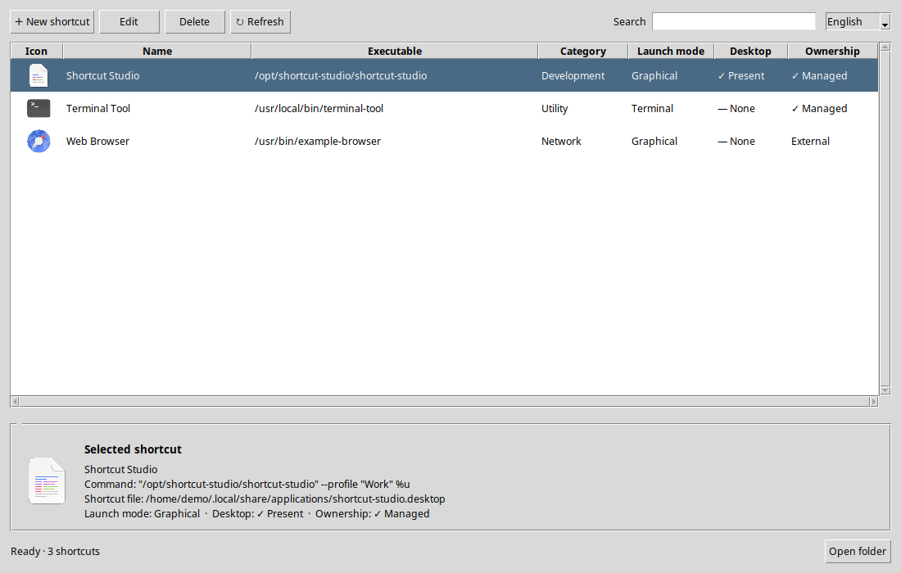
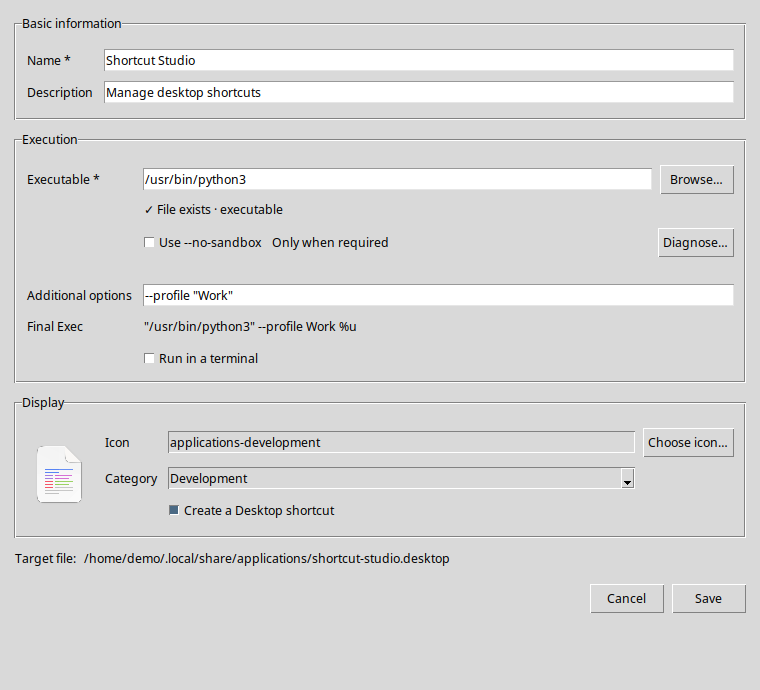
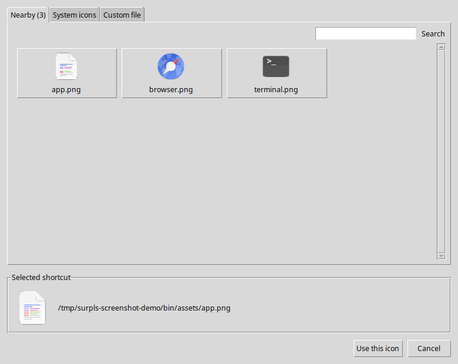
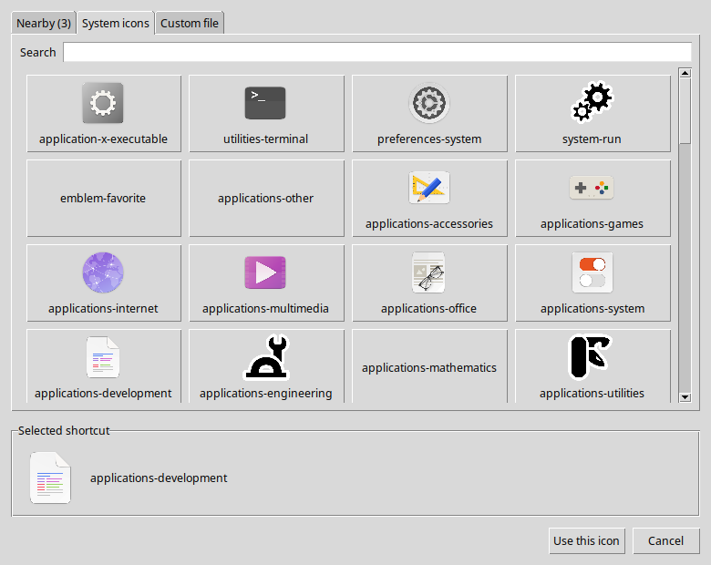
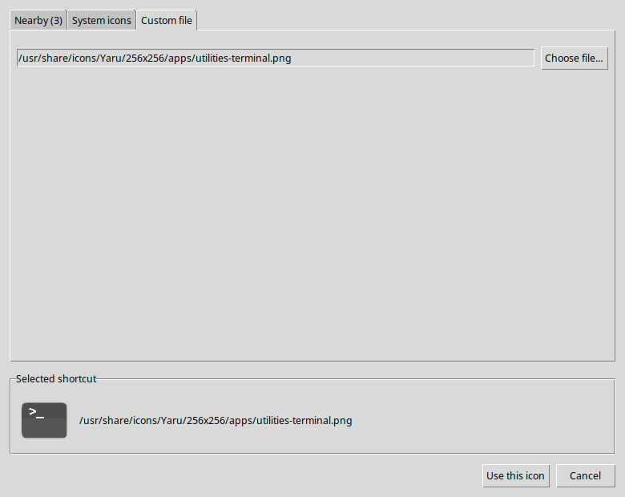
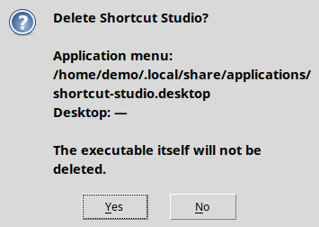
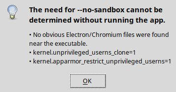

# SurplsShortcut

SurplsShortcut is a Python/Tkinter desktop application for creating and managing per-user GNOME `.desktop` shortcuts. It provides a graphical interface for application-menu entries and optional Desktop copies without requiring users to edit launcher files manually.

The original interactive Bash implementation and its documentation are preserved in [`archive/`](archive/).

## Features

- Searchable list of shortcuts from `~/.local/share/applications`
- Shared form for registering and editing applications
- Separate executable path and command-line options
- Automatic `%u` field-code handling
- Dedicated `--no-sandbox` checkbox with a security warning
- Read-only Electron/Chromium sandbox environment diagnosis
- `Terminal=true` support for launching CLI applications in a terminal
- Nearby image discovery up to three directory levels deep
- Thumbnail selection from 82 common GNOME system icons
- Custom PNG, SVG, ICO, XPM, JPG, and JPEG icon paths; non-PNG files are converted to `icon_cache/<name>_<crc32>.png` beside the executable (Pillow required; SVG needs `rsvg-convert`) and previews only show PNG
- Icon previews in the main list, details panel, editor, and icon picker
- Localized, descriptive status labels instead of raw Boolean values
- Desktop shortcut creation, synchronization, and removal
- Automatic execute permission and GIO `metadata::trusted=true` handling
- Safe deletion of launcher files without deleting the actual application
- Preservation of unsupported fields and action sections in external `.desktop` files
- Detection of files modified externally while an edit dialog is open
- English and Korean user interfaces

## Screenshots

### Main window

The main window combines icon previews, localized shortcut status, search,
management actions, and a larger preview for the selected shortcut.



### Application editor

The same editor is used for registration and modification. The final `Exec`
value and selected icon are previewed before saving.



### Icon picker

Nearby files are discovered asynchronously and displayed as preview tiles.



Freedesktop icon names are resolved against the installed icon themes whenever
a preview is available.



An absolute image path can also be selected from the custom-file tab.



### Delete confirmation

The confirmation identifies every shortcut file in scope and makes clear that
the executable itself is not deleted.



### Sandbox diagnosis

The read-only diagnosis summarizes relevant Electron, kernel, and AppArmor
indicators without launching or modifying the selected application.



## Requirements

- Linux with GNOME or a compatible desktop environment
- Python 3.10 or later
- Tkinter
- `xdg-user-dir` for resolving the configured Desktop directory
- `gio` for GNOME Allow Launching trust metadata
- `update-desktop-database` for refreshing the application database

On Ubuntu or Debian, install the runtime packages with:

```bash
sudo apt update
sudo apt install python3 python3-pip python3-venv python3-tk xdg-user-dirs libglib2.0-bin desktop-file-utils
```

There are currently no third-party pip dependencies. `env.sh` monitors
`requirement.txt`; when dependencies are added, it creates `.venv` and installs
the file again only after its contents change.

```bash
source ./env.sh
```

## Running the application

From the project directory:

```bash
source ./env.sh
python3 app.py
```

`env.sh` configures the project module path, activates an existing `.venv`,
installs changed `requirement.txt` dependencies, and uses either system Tkinter
or an available local fallback. It can also run Python directly:

```bash
./env.sh app.py
```

VS Code uses the same script automatically when launching `app.py` with F5.

The application follows the role-based layout documented in `Design.md`: core
modules live at the project root, with services, UI components, and resources in
separate packages.

If Tkinter is missing, the launcher exits with an installation hint instead of a Python traceback.

## Basic workflow

### Register a shortcut

1. Select **New shortcut**.
2. Choose an executable file.
3. Enter the application name and optional description.
4. Select an icon and category.
5. Enable **Run in a terminal** only for terminal-based applications or scripts.
6. Enable **Create a Desktop shortcut** when a Desktop copy is wanted.
7. Save the entry.

The application writes the launcher to the user application directory and, when selected, copies it to the configured Desktop directory.

### Edit a shortcut

Double-click an item or select it and choose **Edit**. Saving updates the application-menu entry. If the Desktop checkbox remains enabled, the latest file is copied to the Desktop and trusted again. Disabling it removes only the Desktop copy.

### Delete a shortcut

Select an item and choose **Delete**. The confirmation dialog lists both launcher files that may be removed and warns when the file was not originally created by this manager. The executable and icon source files are never deleted.

## Terminal execution

Enabling **Run in a terminal** writes:

```ini
Terminal=true
```

GNOME then opens a terminal and runs the configured `Exec` command inside it. GUI applications normally do not need this option. Terminal-based tools, interactive scripts, or applications whose console output must remain visible generally do.

## `--no-sandbox` diagnosis

The option is disabled by default because it turns off Chromium/Electron process isolation. SurplsShortcut can perform a read-only diagnosis without running the selected application. It checks indicators such as:

- Existing shortcuts for the same executable
- Electron/Chromium files near the executable
- `chrome-sandbox` ownership, execute permission, and setuid mode
- Kernel unprivileged-user-namespace settings
- Ubuntu AppArmor user-namespace restrictions and possible profiles

Static inspection cannot prove that an application will fail at runtime. The diagnosis therefore reports a likelihood and never enables `--no-sandbox` solely from system heuristics. An existing shortcut that already contains the option is represented as checked when edited.

## Managed paths

| Purpose | Path |
|---|---|
| Application-menu entries | `$XDG_DATA_HOME/applications` or `~/.local/share/applications` |
| Desktop copies | `xdg-user-dir DESKTOP` or `~/Desktop` |
| Application settings | `$XDG_CONFIG_HOME/surpls-shortcut/config.json` or `~/.config/surpls-shortcut/config.json` |

Only per-user launchers are managed. System launchers under `/usr/share/applications` are not modified.

## Project structure

```text
SurplsShortcut/
├── .vscode/
│   └── launch.json                     # F5 debugger configuration
├── app.py                              # GUI entry point
├── env.sh                              # Shell and VS Code Python environment
├── models.py                           # DesktopEntry data model
├── config.py                           # Paths, settings, and categories
├── i18n.py                             # English and Korean strings
├── services/
│   ├── desktop_entry_service.py        # Parsing, Exec handling, saving, deletion
│   ├── icon_service.py                 # Nearby and system icon discovery
│   ├── gnome_service.py                # Permissions, trust, and cache refresh
│   └── sandbox_service.py              # Read-only sandbox diagnosis
├── ui/
│   ├── main_window.py                  # List, search, and details
│   ├── app_editor.py                   # Shared create/edit dialog
│   ├── icon_picker.py                  # Icon selection dialog
│   └── delete_dialog.py                # Delete-scope confirmation
├── resources/
│   └── system_icons.py                 # System icon names
├── docs/
│   └── screenshots/                    # Current application screenshots
├── tests/
│   ├── test_desktop_entry.py
│   ├── test_exec_builder.py
│   ├── test_desktop_sync.py
│   └── test_sandbox.py
├── archive/                            # Legacy Bash implementation and docs
├── Design.md                           # GUI and workflow design
└── requirement.txt                     # Python dependency declaration
```

## Tests

Run the complete test suite with:

```bash
./env.sh -m unittest discover -v
```

The tests cover `Exec` parsing and construction, `--no-sandbox` separation, unknown desktop-entry field preservation, external-change conflicts, Desktop copy synchronization and removal, exact GNOME trust metadata, deletion safety, and static sandbox diagnosis.

## Legacy Bash version

The previous terminal-based implementation remains available at:

```text
archive/gnome_shortcut_manager.sh
```

Its original English and Korean documentation is stored beside it. New development should target the role-based Python modules listed above.

## Design

See [`Design.md`](Design.md) for the detailed screen layout, interaction flows, data model, safety policy, and implementation decisions.
